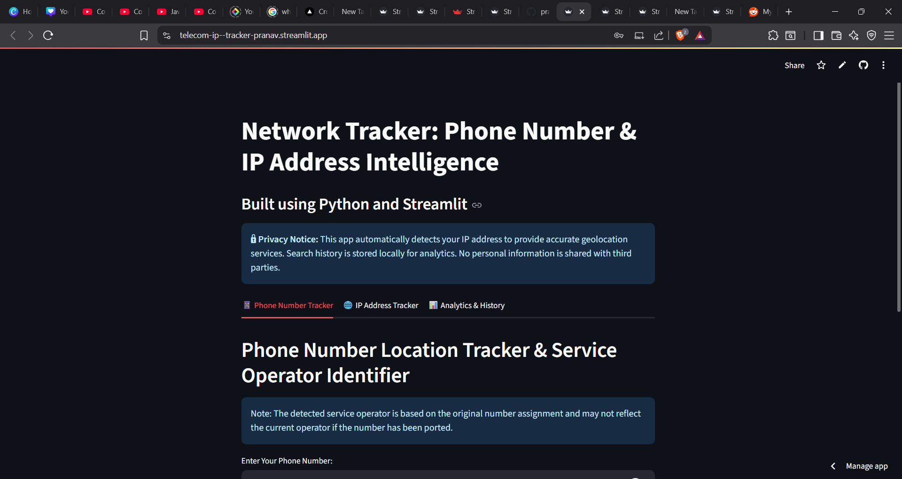
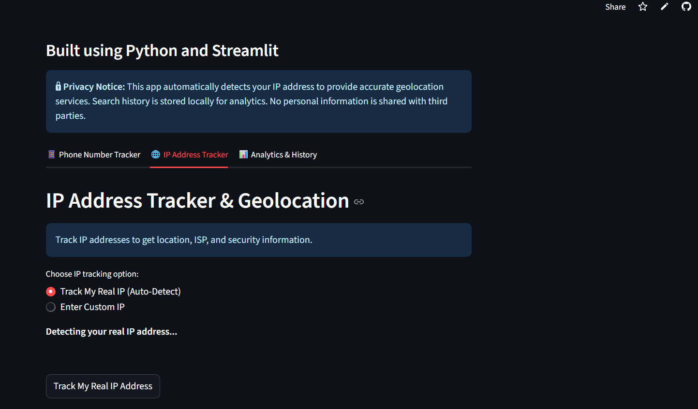
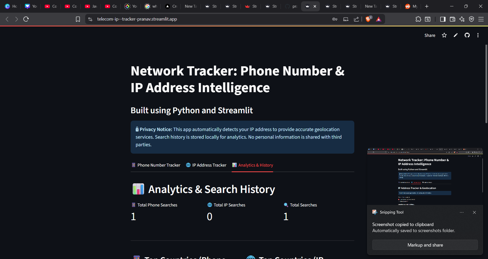

# Telecom & IP Address Tracker

A web app to track phone number details (location, operator) and IP address geolocation/network info, built with Python and Streamlit.

## Features
- Track phone number country and service operator
- Track IP address geolocation, ISP, ASN, and more
- Simple web interface (no coding required)

## Demo Images




## Demo
Deploy your own copy for free using [Streamlit Community Cloud](https://streamlit.io/cloud)!

## Getting Started

### 1. Local Installation

1. **Clone the repository:**
   ```bash
   git clone https://github.com/yourusername/your-repo.git
   cd your-repo
   ```
2. **Install dependencies:**
   ```bash
   pip install -r requirements.txt
   ```
3. **Run the app:**
   ```bash
   streamlit run tracker.py
   ```
   Or, if using a virtual environment:
   ```bash
   python -m streamlit run tracker.py
   ```
4. Open your browser to [http://localhost:8501](http://localhost:8501)

### 2. Deploy on Streamlit Community Cloud

1. Push your code (including `requirements.txt`) to a GitHub repository.
2. Go to [https://streamlit.io/cloud](https://streamlit.io/cloud) and sign in with GitHub.
3. Click "New app", select your repo and `tracker.py` as the main file.
4. Click "Deploy". Your app will be live at a public URL!

## Requirements
- Python 3.8+
- See `requirements.txt` for Python dependencies

## License
MIT 